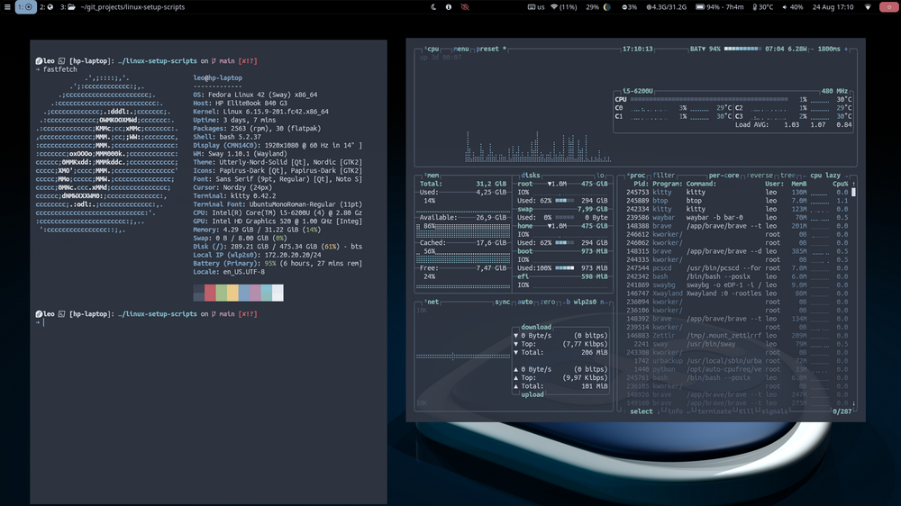
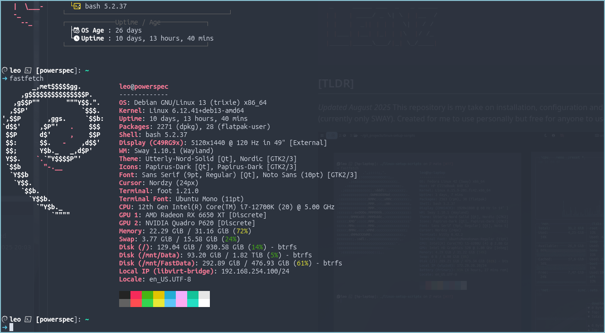

```bash
 _     _____ ___  _   _ _____
| |   | ____/ _ \| \ | |__  /
| |   |  _|| | | |  \| | / / 
| |___| |__| |_| | |\  |/ /_ 
|_____|_____\___/|_| \_/____|
                             
```                                                        
## [TLDR]
_Updated September 2025_
This repository is my take on installation, configuration and customization of Debian and Fedora. Created for me to use personally but free for anyone to use. Debian setup is minimal with no DE but built for a Wayland-based WM/DE while Fedora configuration buids on top of a minimal [Sway spin](https://fedoraproject.org/spins/sway)

Fedora:



Debian:



## [WHAT’S INCLUDED]

### Actual setup - Debian
- Follow standard install procedure with partitioning setup to allow timeshift btrfs snapshots - [use this guide](https://www.youtube.com/watch?v=_zC4S7TA1GI)
- Configure zram as well
- Verify internet connection and at minimum install `git` and `wget`
- Download this script into /tmp using wget:
`wget https://raw.githubusercontent.com/leonzwrx/linux-setup-scripts/refs/heads/main/debian_base_trixie.sh`
 
### Actual setup - Fedora
- Download [iso](https://fedoraproject.org/spins/sway/download), install, follow defaults
- Use standard partitioning with btrfs (may switch to manual partitioning for easier Timeshift snapshot integration)
- zram should be configured out of the box

### Install Scripts:

* debian_base_trixie.sh - installs base Debian Trixie tools and packages after minimal-install without GUI
* debian_extras_trixie.sh - additional packages and tools I use for Debian
* [NEED TO REVISIT] fedora_install_base.sh - base Fedora tools and packages post fresh-install
* [NEED TO REVISIT] fedora_extras.sh - additional packages and tools I use for Fedora
___

### Other Scripts:
* [OPTIONAL] neovim.sh - downloads and installs the latest neovim from source on Debian
* nerdfonts.sh – downloads and installs Nerd Fonts I use
* /resources - other files referenced by scripts
* /archive - collection of legacy scripts and documentation
 ___

### DOCUMENTATION
* [pre-install-prep.md](documentation/pre-install-prep.md) - checklist with pre-install tasks
* [post-install-configs_all.md](documentation/post-install-configs_all.md) - tasks and checklists for all fresh installs
* [post-install-configs_mint.md ](documentation/post-install-configs_mint.md)- tasks and checklist for a fresh Linux mint (mostly for a laptop) after a GUI install
* https://github.com/leonzwrx/dotfiles/tree/master - my dotfiles repo 
* https://github.com/leonzwrx/homelab-wiki/tree/master - my documentation / wiki repo
* https://github.com/leonzwrx/sway-setup - Sway WM setup

## 🙏 Inspiration & Credits

* **[JAG Linux](https://codeberg.org/justaguylinux)** – Huge thanks to Drew / JAG Linux for ideas and partioning and setup guides